# Test Automation Project - Architecture Diagrams

## System Architecture Overview

```mermaid
graph TB
    subgraph "WPF Application Layer"
        MainWindow[MainWindow.xaml.cs]
        ScriptEditor[ScriptEditorWindow.xaml.cs]
    end

    subgraph "Component Layer"
        Component[Component.cs]
        Http[Http.cs]
        GraphQl[GraphQl.cs]
        Sql[Sql.cs]
        Dataset[Dataset.cs]
        Script[Script.cs]
        Timer[Timer.cs]
        Loop[Loop.cs]
        Foreach[Foreach.cs]
        If[If.cs]
        Threads[Threads.cs]
        VariableExtractor[VariableExtractor.cs]
        Assert[Assert.cs]
        Config[Config.cs]
        TestPlan[TestPlan.cs]
    end

    subgraph "Service Layer"
        ComponentExecutor[ComponentExecutor.cs]
        VariableService[VariableService.cs]
        AssertionService[AssertionService.cs]
        ConditionService[ConditionService.cs]
        ScriptEngine[ScriptEngine.cs]
        PreviewBuilder[PreviewBuilder.cs]
    end

    subgraph "Model Layer"
        PlanNode[PlanNode.cs]
        ExecutionContext[ExecutionContext.cs]
        ExecutionResult[ExecutionResult.cs]
        ComponentData[ComponentModels.cs]
        PreviewModels[PreviewModels.cs]
    end

    subgraph "Project File Models"
        ProjectFileModel[ProjectFileModel.cs]
        NodeFileModel[NodeFileModel.cs]
        AssertionFileModel[AssertionFileModel.cs]
        VariableExtractionFileModel[VariableExtractionFileModel.cs]
    end

    MainWindow --> ComponentExecutor
    MainWindow --> PlanNode
    ComponentExecutor --> Component
    ComponentExecutor --> VariableService
    ComponentExecutor --> AssertionService
    ComponentExecutor --> ConditionService
    ComponentExecutor --> PreviewBuilder
    Component --> ComponentData
    ComponentExecutor --> ExecutionContext
    ComponentExecutor --> ExecutionResult
    PlanNode --> NodeFileModel
    ExecutionContext --> ExecutionResult
```

## Component Hierarchy

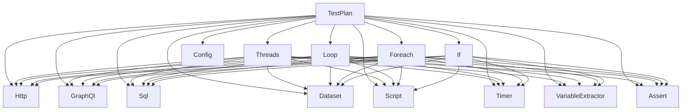

## Execution Flow

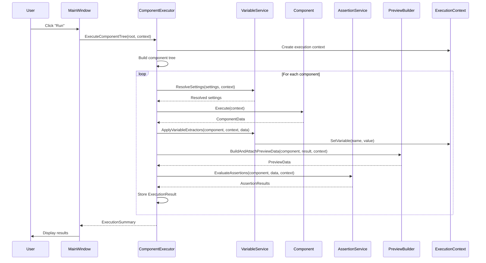

## Variable Resolution Flow

```mermaid
flowchart TD
    Start([Start]) --> GetSettings[Get Component Settings]
    GetSettings --> FindPattern{Find ${...} pattern?}
    FindPattern -->|No| ReturnSettings[Return Settings]
    FindPattern -->|Yes| ExtractVarName[Extract Variable Name]
    ExtractVarName --> LookupVar{Variable exists?}
    LookupVar -->|No| KeepPattern[Keep ${...} pattern]
    LookupVar -->|Yes| GetVarValue[Get Variable Value]
    GetVarValue --> ReplacePattern[Replace ${...} with value]
    ReplacePattern --> MorePatterns{More patterns?}
    KeepPattern --> MorePatterns
    MorePatterns -->|Yes| FindPattern
    MorePatterns -->|No| ReturnResolved[Return Resolved Settings]
    ReturnSettings --> End([End])
    ReturnResolved --> End
```

## Variable Extraction Flow

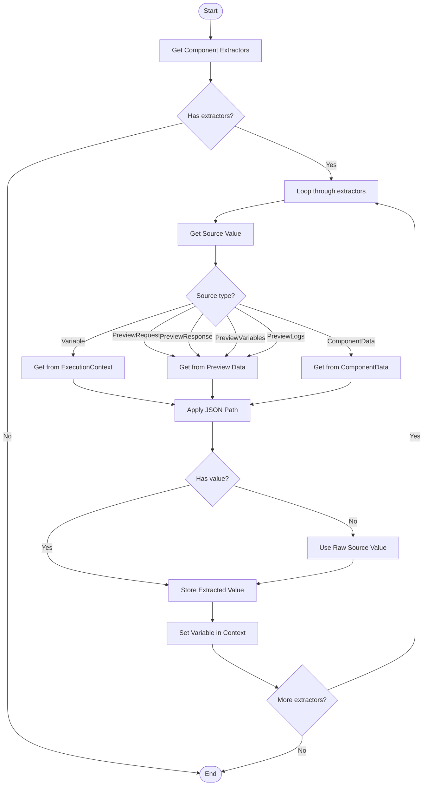

## Assertion Evaluation Flow

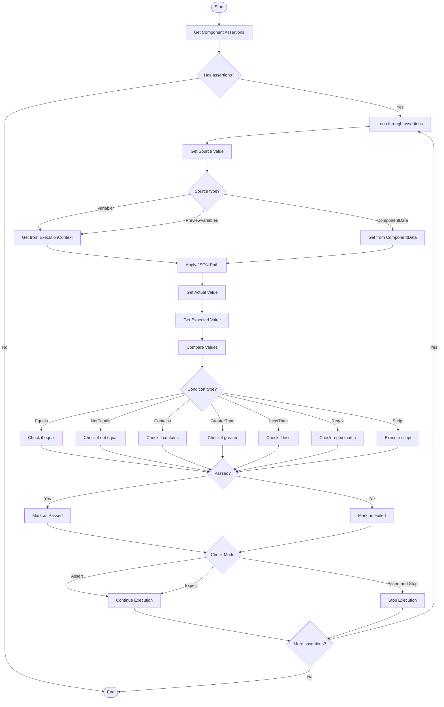

## Component Data Models

```mermaid
classDiagram
    class ComponentData {
        +string Id
        +string ComponentName
        +Dictionary~string, object~ Properties
        +DateTime Timestamp
    }

    class HttpData {
        +string Url
        +string Method
        +Dictionary~string, string~ Headers
        +string Body
        +int? ResponseStatus
        +string ResponseBody
        +Dictionary~string, string~ ResponseHeaders
    }

    class GraphQlData {
        +string Endpoint
        +string Query
        +string Variables
        +Dictionary~string, string~ Headers
        +int? ResponseStatus
        +string ResponseBody
    }

    class SqlData {
        +string Provider
        +string ConnectionString
        +string Query
        +List~Dictionary~string, object~~ QueryResult
    }

    class DatasetData {
        +string DataSource
        +List~Dictionary~string, object~~ Rows
        +int CurrentRow
    }

    class ScriptData {
        +string ScriptCode
        +string ScriptLanguage
        +string ExecutionResult
    }

    class TimerData {
        +int DelayMs
        +bool Executed
    }

    class LoopData {
        +int Iterations
        +int CurrentIteration
        +List~string~ ChildComponents
    }

    class ForeachData {
        +List~object~ Collection
        +int CurrentIndex
        +object? CurrentItem
        +string OutputVariable
        +List~string~ ChildComponents
    }

    class IfData {
        +string Condition
        +bool ConditionMet
        +List~string~ TrueComponents
        +List~string~ FalseComponents
    }

    class ThreadsData {
        +int ThreadCount
        +int RampUpTime
        +List~string~ ChildComponents
    }

    class VariableExtractorData {
        +string Source
        +string Pattern
        +string VariableName
        +string ExtractedValue
    }

    class AssertData {
        +object? ExpectedValue
        +object? ActualValue
        +string Operator
        +bool Passed
        +string ErrorMessage
    }

    class ConfigData {
        +Dictionary~string, object~ Configurations
    }

    class TestPlanData {
        +string TestPlanName
        +string Description
        +List~string~ Components
        +DateTime StartTime
        +DateTime EndTime
        +string Status
    }

    ComponentData <|-- HttpData
    ComponentData <|-- GraphQlData
    ComponentData <|-- SqlData
    ComponentData <|-- DatasetData
    ComponentData <|-- ScriptData
    ComponentData <|-- TimerData
    ComponentData <|-- LoopData
    ComponentData <|-- ForeachData
    ComponentData <|-- IfData
    ComponentData <|-- ThreadsData
    ComponentData <|-- VariableExtractorData
    ComponentData <|-- AssertData
    ComponentData <|-- ConfigData
    ComponentData <|-- TestPlanData
```

## Service Dependencies

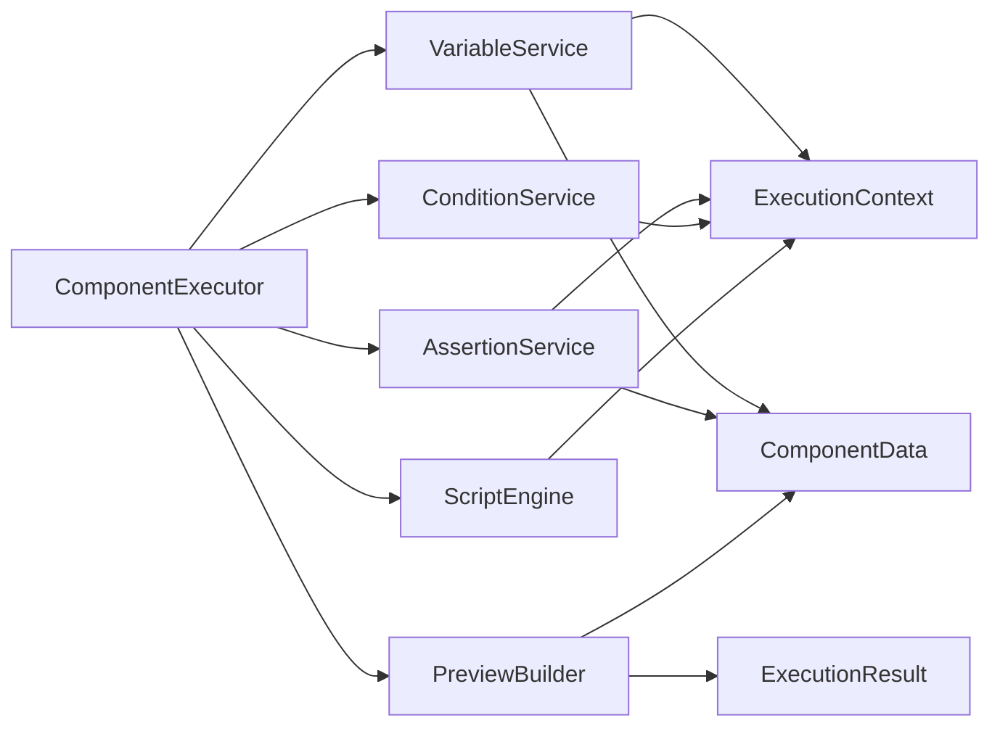

## Project File Structure

```mermaid
graph TD
    ProjectFile[ProjectFileModel.json]
    ProjectFile --> Version[Version: 1]
    ProjectFile --> Project[Project: NodeFileModel]

    Project --> Id[Id: GUID]
    Project --> Type[Type: "Project"]
    Project --> Name[Name: "My Test Plan"]
    Project --> Enabled[Enabled: true]
    Project --> Settings[Settings: Dictionary]
    Project --> Variables[Variables: Dictionary]
    Project --> Extractors[Extractors: List]
    Project --> Assertions[Assertions: List]
    Project --> Children[Children: List]

    Children --> Child1[Child Node 1]
    Children --> Child2[Child Node 2]
    Children --> Child3[Child Node 3]

    Child1 --> Child1Settings[Settings]
    Child1 --> Child1Extractors[Extractors]
    Child1 --> Child1Assertions[Assertions]
    Child1 --> Child1Children[Children]

    Child2 --> Child2Settings[Settings]
    Child2 --> Child2Extractors[Extractors]
    Child2 --> Child2Assertions[Assertions]
    Child2 --> Child2Children[Children]

    Child3 --> Child3Settings[Settings]
    Child3 --> Child3Extractors[Extractors]
    Child3 --> Child3Assertions[Assertions]
    Child3 --> Child3Children[Children]
```

## Authentication Flow

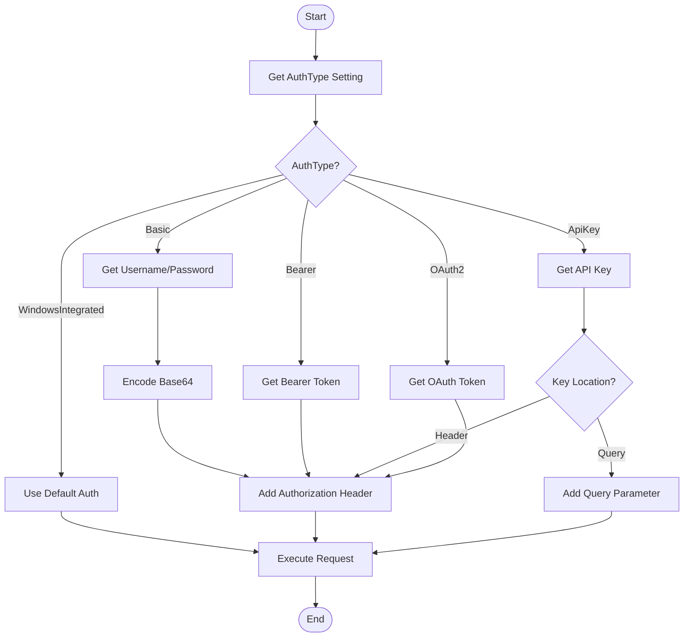

## Threading Model

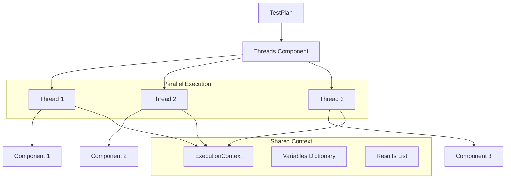

## Error Handling Flow

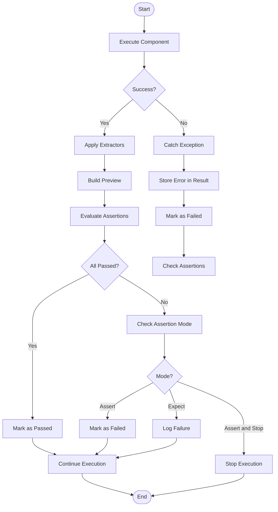

## Data-Driven Testing Flow

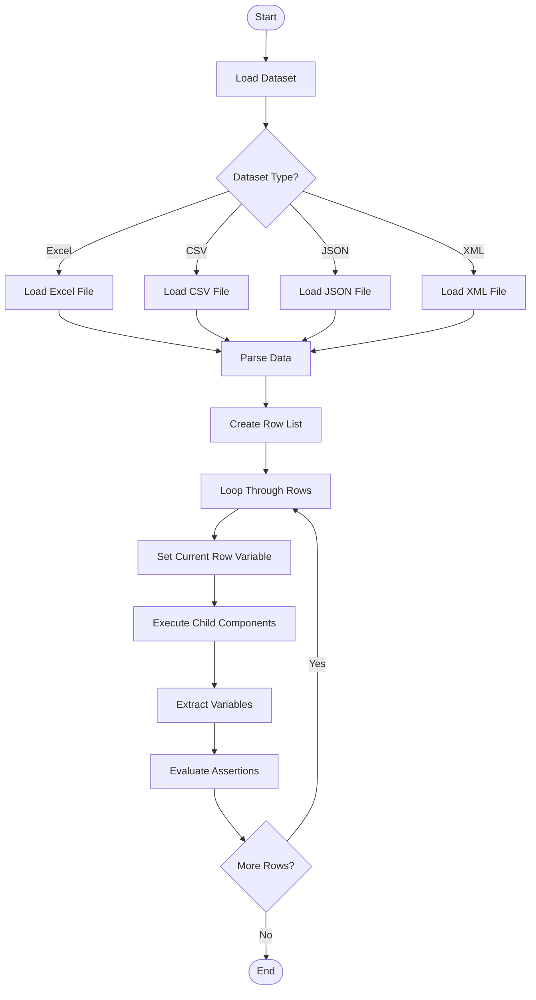

## Summary

These diagrams illustrate the complete architecture and flow of the Test Automation project:

1. **System Architecture**: Shows the layered architecture with WPF UI, Components, Services, and Models
2. **Component Hierarchy**: Illustrates how components can be nested and organized
3. **Execution Flow**: Demonstrates the sequence of operations during test execution
4. **Variable Resolution**: Shows how variables are resolved in settings
5. **Variable Extraction**: Illustrates how values are extracted from component data
6. **Assertion Evaluation**: Shows the assertion evaluation process
7. **Component Data Models**: Displays the inheritance hierarchy of component data
8. **Service Dependencies**: Shows how services interact with each other
9. **Project File Structure**: Illustrates the JSON file format for saving projects
10. **Authentication Flow**: Shows how different authentication types are handled
11. **Threading Model**: Illustrates parallel execution with threads
12. **Error Handling**: Shows how errors are handled during execution
13. **Data-Driven Testing**: Illustrates the flow of data-driven tests

These diagrams provide a comprehensive visual understanding of how the test automation framework works.
