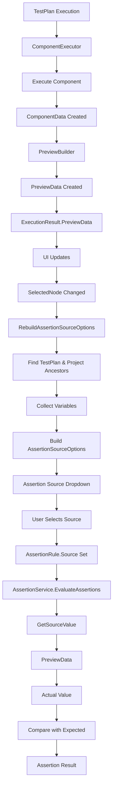

# How Data Flows from Test Plan to Assertion Source

## Overview

This document explains how data flows from the test plan execution through the component hierarchy to the assertion source dropdown in the UI. The assertion source options are dynamically populated based on the selected component and its context within the test plan.

## Data Flow Diagram



## Step-by-Step Data Flow

### **Step 1: Test Plan Execution**

When you run a test plan, the [`ComponentExecutor`](Test Automation/services/ComponentExecutor.cs) executes each component:

```csharp
// ComponentExecutor.cs - ExecuteComponent method
public async Task<ExecutionResult> ExecuteComponent(Component component, ExecutionContext context)
{
    // 1. Resolve variables in settings
    component.Settings = _variableService.ResolveSettings(settingsToResolve, context);
    
    // 2. Execute component
    var componentData = await component.Execute(context);
    
    // 3. Apply variable extractors
    _variableService.ApplyVariableExtractors(component, context, componentData, TraceLog);
    
    // 4. Build preview data
    _previewBuilder.BuildAndAttachPreviewData(component, result, context);
    
    // 5. Evaluate assertions
    var assertionResults = _assertionService.EvaluateAssertions(component, componentData, context, TraceLog);
    
    return result;
}
```

### **Step 2: Component Data Creation**

Each component creates its own data model. For example, [`Http.cs`](Test Automation/componentes/Http.cs):

```csharp
// Http.cs - Execute method
public override async Task<ComponentData> Execute(ExecutionContext context)
{
    var data = new HttpData
    {
        Id = this.Id,
        ComponentName = this.Name,
        Method = Settings.TryGetValue("Method", out var method) ? method : "GET",
        Url = url,
        Body = Settings.TryGetValue("Body", out var body) ? body : string.Empty
    };
    
    // Make HTTP request
    using var response = await client.SendAsync(request, context.StopToken);
    data.ResponseStatus = (int)response.StatusCode;
    data.ResponseBody = await response.Content.ReadAsStringAsync(context.StopToken);
    
    return data;
}
```

### **Step 3: Preview Data Creation**

The [`PreviewBuilder`](Test Automation/services/PreviewBuilder.cs) creates preview data from the component data:

```csharp
// PreviewBuilder.cs - CreatePreviewData method
public ComponentPreviewData CreatePreviewData(Component component, ExecutionResult result, ExecutionContext context)
{
    ComponentPreviewData previewData = result.Data switch
    {
        HttpData http => CreateHttpPreview(http, result),
        GraphQlData gql => CreateGraphQlPreview(gql, result),
        SqlData sql => CreateSqlPreview(sql, result),
        // ... other component types
        _ => CreateGenericPreview(result)
    };
    
    // Add variable extraction results
    if (component.Extractors != null)
    {
        for (int i = 0; i < component.Extractors.Count; i++)
        {
            var extractor = component.Extractors[i];
            var extractionResult = new VariableExtractionResult
            {
                VariableName = extractor.VariableName,
                Source = extractor.Source,
                JsonPath = extractor.JsonPath,
                ExtractedValue = context.GetVariable(extractor.VariableName)?.ToString() ?? string.Empty,
                WasSuccessful = context.HasVariable(extractor.VariableName)
            };
            previewData.VariableExtractions.Add(extractionResult);
        }
    }
    
    // Add assertion results
    if (result.AssertionResults != null)
    {
        foreach (var ar in result.AssertionResults)
        {
            previewData.AssertionResults.Add(new AssertionResultData
            {
                Index = ar.Index,
                Mode = ar.Mode,
                Source = ar.Source,
                JsonPath = ar.JsonPath,
                Condition = ar.Condition,
                Expected = ar.Expected,
                Actual = ar.Actual,
                Passed = ar.Passed,
                Message = ar.Message
            });
        }
    }
    
    return previewData;
}
```

### **Step 4: Preview Data Storage**

The preview data is stored in the [`ExecutionResult`](Test Automation/models/ExecutionModels.cs):

```csharp
// ExecutionResult.cs
public class ExecutionResult
{
    [JsonPropertyName("previewData")]
    public ComponentPreviewData? PreviewData { get; set; }
    
    // ... other properties
}
```

### **Step 5: UI Updates Preview**

When you select a component in the UI, [`MainWindow.xaml.cs`](Test Automation/MainWindow.xaml.cs) updates the preview:

```csharp
// MainWindow.xaml.cs - RefreshComponentPreview method
private void RefreshComponentPreview()
{
    if (SelectedNode == null) return;
    
    // Get latest execution result for selected component
    var latestExecution = GetLatestExecutionResult(SelectedNode.Id);
    
    if (latestExecution?.PreviewData is HttpPreviewData httpPreview)
    {
        // Update PreviewRequest
        PreviewRequest = JsonSerializer.Serialize(new
        {
            component = nodeName,
            type = "Http",
            method = httpPreview.Method,
            url = httpPreview.Url,
            status = latestExecution.Status,
            error = latestExecution.Error,
            threadIndex = latestExecution.ThreadIndex,
            durationMs = latestExecution.DurationMs
        }, PrettyJsonOptions);
        
        // Update PreviewResponse
        PreviewResponse = JsonSerializer.Serialize(new
        {
            status = httpPreview.ResponseStatus,
            body = httpPreview.ResponseBody,
            headers = httpPreview.ResponseHeaders
        }, PrettyJsonOptions);
        
        // Update PreviewLogs
        PreviewLogs = $"[{now}] HTTP preview refreshed\n[{now}] Target: {method} {url}";
    }
}
```

### **Step 6: Assertion Source Options Rebuilt**

When you select a component, [`RebuildAssertionSourceOptions()`](Test Automation/MainWindow.xaml.cs) is called:

```csharp
// MainWindow.xaml.cs - RebuildAssertionSourceOptions method
private void RebuildAssertionSourceOptions()
{
    AssertionSourceOptions.Clear();
    
    // Add base sources
    AssertionSourceOptions.Add("PreviewVariables");
    AssertionSourceOptions.Add("PreviewRequest");
    AssertionSourceOptions.Add("PreviewResponse");
    AssertionSourceOptions.Add("PreviewLogs");
    
    if (SelectedNode == null) return;
    
    // Find TestPlan and Project ancestors
    PlanNode? testPlanNode = null;
    PlanNode? projectNode = null;
    var current = SelectedNode;
    
    while (current != null)
    {
        if (string.Equals(current.Type, "TestPlan", StringComparison.OrdinalIgnoreCase))
        {
            testPlanNode = current;
        }
        else if (string.Equals(current.Type, "Project", StringComparison.OrdinalIgnoreCase))
        {
            projectNode = current;
        }
        current = current.Parent;
    }
    
    // Collect variables from Project (global) and TestPlan (local)
    var variables = new HashSet<string>(StringComparer.OrdinalIgnoreCase);
    
    // Add global variables from Project
    if (projectNode != null)
    {
        foreach (var variable in projectNode.Variables)
        {
            if (!string.IsNullOrWhiteSpace(variable.Key))
            {
                variables.Add(variable.Key);
            }
        }
    }
    
    // Add local variables from TestPlan
    if (testPlanNode != null)
    {
        foreach (var variable in testPlanNode.Variables)
        {
            if (!string.IsNullOrWhiteSpace(variable.Key))
            {
                variables.Add(variable.Key);
            }
        }
    }
    
    // Add collected variables with "Variable." prefix
    foreach (var varName in variables.OrderBy(v => v, StringComparer.OrdinalIgnoreCase))
    {
        var varSource = $"Variable.{varName}";
        if (!AssertionSourceOptions.Contains(varSource))
        {
            AssertionSourceOptions.Add(varSource);
        }
    }
}
```

### **Step 7: User Selects Assertion Source**

When you select an assertion source from the dropdown, it's stored in the [`AssertionRule`](Test Automation/models/editor/AssertionRule.cs):

```csharp
// AssertionRule.cs
public class AssertionRule : INotifyPropertyChanged
{
    private string _source;
    
    public string Source
    {
        get => _source;
        set
        {
            if (_source == value) return;
            _source = value;
            OnPropertyChanged();
        }
    }
    
    // ... other properties
}
```

### **Step 8: Assertion Evaluation**

When assertions are evaluated, [`AssertionService`](Test Automation/services/AssertionService.cs) uses the source to get the actual value:

```csharp
// AssertionService.cs - EvaluateAssertions method
public List<AssertionEvaluationResult> EvaluateAssertions(Component component, ComponentData? componentData, ExecutionContext context, Action<string> trace)
{
    var results = new List<AssertionEvaluationResult>();
    
    for (var index = 0; index < component.Assertions.Count; index++)
    {
        var assertion = component.Assertions[index];
        
        // Get source value based on assertion.Source
        object? sourceValue;
        
        if (assertion.Source.StartsWith("Variable.", StringComparison.OrdinalIgnoreCase))
        {
            // Handle Variable.varname - get from context
            var varName = assertion.Source.Substring("Variable.".Length);
            sourceValue = context.GetVariable(varName);
        }
        else if (assertion.Source.StartsWith("PreviewVariables.", StringComparison.OrdinalIgnoreCase))
        {
            // Handle PreviewVariables.varname - get from context
            var varName = assertion.Source.Substring("PreviewVariables.".Length);
            sourceValue = context.GetVariable(varName);
        }
        else if (string.Equals(assertion.Source, "PreviewVariables", StringComparison.OrdinalIgnoreCase))
        {
            // Return all variables as JSON
            var variables = new Dictionary<string, object>();
            foreach (var key in context.Variables.Keys)
            {
                variables[key] = context.GetVariable(key) ?? string.Empty;
            }
            sourceValue = JsonSerializer.Serialize(variables);
        }
        else
        {
            // Get from component data (PreviewRequest, PreviewResponse, PreviewLogs)
            sourceValue = GetSourceValue(assertion.Source, componentData);
        }
        
        // Extract value using JSON path
        var actualValue = ExtractValue(sourceValue, assertion.JsonPath);
        
        // Compare with expected value
        var (passed, message) = Compare(actualValue, assertion.Condition, assertion.Expected);
        
        // Store result
        var result = new AssertionEvaluationResult
        {
            Index = index,
            Passed = passed,
            Message = message,
            Mode = assertion.Mode,
            Source = assertion.Source,
            JsonPath = assertion.JsonPath,
            Condition = assertion.Condition,
            Expected = assertion.Expected,
            Actual = ConvertToText(actualValue)
        };
        results.Add(result);
    }
    
    return results;
}
```

### **Step 9: Get Source Value**

The [`GetSourceValue()`](Test Automation/services/AssertionService.cs) method retrieves the actual value from the component data:

```csharp
// AssertionService.cs - GetSourceValue method
private object? GetSourceValue(string source, ComponentData? componentData)
{
    if (componentData == null) return null;
    
    // Handle PreviewRequest - return request data
    if (string.Equals(source, "PreviewRequest", StringComparison.OrdinalIgnoreCase))
    {
        return componentData switch
        {
            HttpData http => new { Method = http.Method, Url = http.Url, Headers = http.Headers, Body = http.Body },
            GraphQlData gql => new { Endpoint = gql.Endpoint, Query = gql.Query, Variables = gql.Variables, Headers = gql.Headers },
            SqlData sql => new { Provider = sql.Provider, ConnectionString = sql.ConnectionString, Query = sql.Query },
            _ => componentData
        };
    }
    
    // Handle PreviewResponse - return response data
    if (string.Equals(source, "PreviewResponse", StringComparison.OrdinalIgnoreCase))
    {
        return componentData switch
        {
            HttpData http => new { Status = http.ResponseStatus, Body = http.ResponseBody, Headers = http.ResponseHeaders },
            GraphQlData gql => new { Status = gql.ResponseStatus, Body = gql.ResponseBody },
            SqlData sql => new { Rows = sql.QueryResult },
            _ => componentData
        };
    }
    
    // Handle PreviewLogs - return logs
    if (string.Equals(source, "PreviewLogs", StringComparison.OrdinalIgnoreCase))
    {
        return componentData.Properties.TryGetValue("logs", out var logs) ? logs : string.Empty;
    }
    
    // Default - return entire component data
    return componentData;
}
```

## Assertion Source Options

The assertion source dropdown contains the following options:

### **Base Sources** (Always Available)
1. **PreviewVariables** - All variables from execution context as JSON
2. **PreviewRequest** - Request data from component execution
3. **PreviewResponse** - Response data from component execution
4. **PreviewLogs** - Logs from component execution

### **Variable Sources** (Dynamic)
- **Variable.{variableName}** - Specific variable from Project or TestPlan scope
- Example: `Variable.authToken`, `Variable.userId`, `Variable.status`

## Example Data Flow

### **Scenario: HTTP Login Test with Token Extraction**

```
1. Test Plan Structure:
   Project
   └── TestPlan
       └── Http (Login)
           └── VariableExtractor (Extract Token)
           └── Http (Get User)
               └── Assert (Check Status)

2. Execution Flow:
   a. Http (Login) executes
      - Makes POST request to /login
      - Response: {"token": "abc123", "userId": "456"}
      - Creates HttpData with ResponseBody
   
   b. PreviewBuilder creates HttpPreviewData
      - Method: POST
      - Url: https://api.example.com/login
      - ResponseStatus: 200
      - ResponseBody: {"token": "abc123", "userId": "456"}
   
   c. VariableExtractor executes
      - Source: ResponseBody
      - JsonPath: $.token
      - VariableName: authToken
      - Extracts: authToken = "abc123"
      - Stores in ExecutionContext
   
   d. Http (Get User) executes
      - Makes GET request to /users/456
      - Headers: {"Authorization": "Bearer ${authToken}"}
      - Response: {"name": "John Doe", "email": "john@example.com"}
      - Creates HttpData with ResponseBody
   
   e. PreviewBuilder creates HttpPreviewData
      - Method: GET
      - Url: https://api.example.com/users/456
      - ResponseStatus: 200
      - ResponseBody: {"name": "John Doe", "email": "john@example.com"}

3. UI Updates:
   a. User selects Http (Get User) component
   b. RebuildAssertionSourceOptions() is called
   c. AssertionSourceOptions is populated:
      - PreviewVariables
      - PreviewRequest
      - PreviewResponse
      - PreviewLogs
      - Variable.authToken (from TestPlan)
   
   d. User adds assertion:
      - Source: PreviewResponse
      - JsonPath: $.name
      - Condition: Equals
      - Expected: "John Doe"
   
   e. Assertion is evaluated:
      - GetSourceValue("PreviewResponse", httpData)
      - Returns: {Status: 200, Body: {"name": "John Doe", "email": "john@example.com"}}
      - ExtractValue(sourceValue, "$.name")
      - Returns: "John Doe"
      - Compare("John Doe", "Equals", "John Doe")
      - Result: Passed
```

## Key Points

### **1. Preview Data is Component-Specific**
- Each component type creates its own preview data structure
- HttpPreviewData contains Method, Url, Headers, Body, ResponseStatus, ResponseBody, ResponseHeaders
- GraphQlPreviewData contains Endpoint, Query, Variables, Headers, ResponseStatus, ResponseBody
- SqlPreviewData contains Provider, ConnectionString, Query, Rows

### **2. Assertion Source Options are Dynamic**
- Base sources (PreviewVariables, PreviewRequest, PreviewResponse, PreviewLogs) are always available
- Variable sources (Variable.{name}) are added based on Project and TestPlan scope
- Options are rebuilt when selected component changes

### **3. Source Value Retrieval is Context-Aware**
- PreviewVariables: Returns all variables from ExecutionContext as JSON
- PreviewRequest: Returns request data from ComponentData
- PreviewResponse: Returns response data from ComponentData
- PreviewLogs: Returns logs from ComponentData
- Variable.{name}: Returns specific variable from ExecutionContext

### **4. JSON Path Extraction**
- After getting source value, JSON path is applied to extract specific value
- Example: `$.data.token` extracts token from nested JSON
- If JSON path is empty, entire source value is used

### **5. Assertion Evaluation**
- Actual value is compared with expected value using specified condition
- Result is stored in AssertionEvaluationResult
- Assertion mode determines how failure is handled

## Summary

The data flow from test plan to assertion source follows this path:

```
TestPlan Execution
    ↓
Component Execution
    ↓
ComponentData Creation
    ↓
PreviewBuilder Creates PreviewData
    ↓
PreviewData Stored in ExecutionResult
    ↓
UI Updates Preview Display
    ↓
User Selects Component
    ↓
RebuildAssertionSourceOptions()
    ↓
Find TestPlan & Project Ancestors
    ↓
Collect Variables from Scope
    ↓
Build AssertionSourceOptions
    ↓
User Selects Assertion Source
    ↓
AssertionRule.Source Set
    ↓
AssertionService Evaluates
    ↓
GetSourceValue() Retrieves Data
    ↓
ExtractValue() Applies JSON Path
    ↓
Compare() Evaluates Condition
    ↓
Assertion Result Stored
```

This flow ensures that assertion sources are dynamically populated based on the selected component's context and available data from test plan execution.
