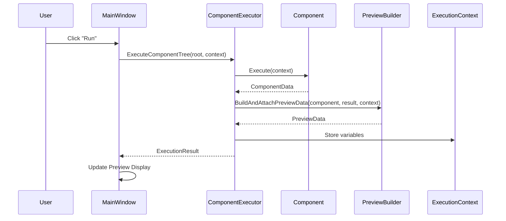
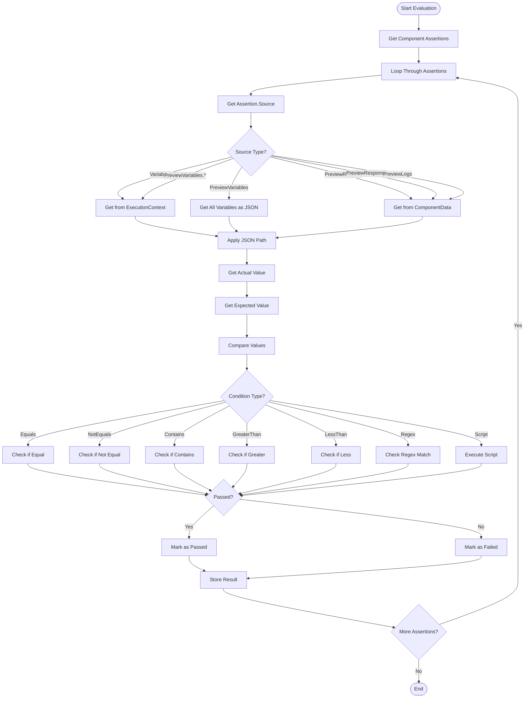
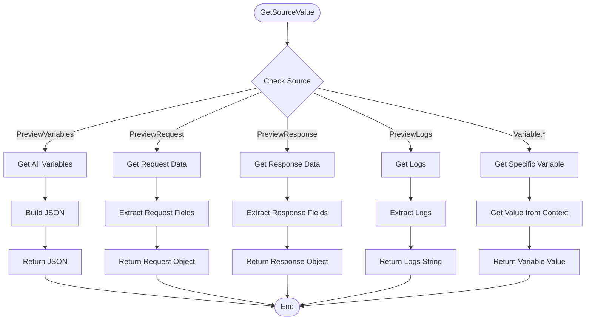
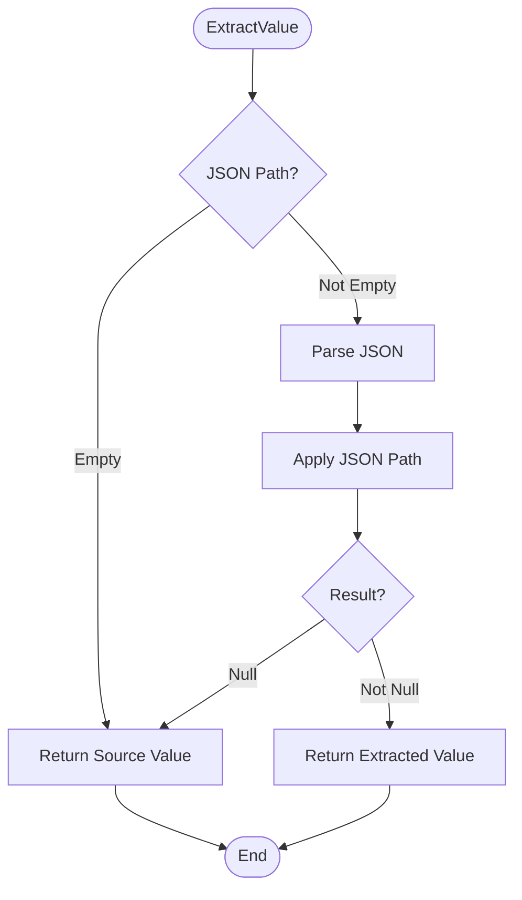
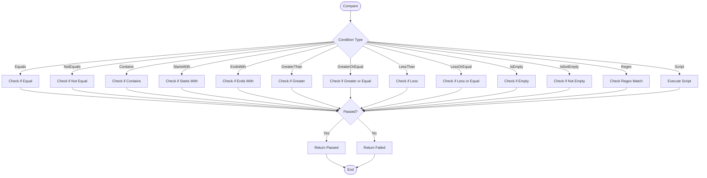

# Assertion Source Data Flow - Visual Diagrams

## Complete Data Flow Overview

```mermaid
graph TD
    subgraph "Test Plan Execution"
        TestPlan[TestPlan]
        ComponentExecutor[ComponentExecutor]
        ExecuteComponent[Execute Component]
        ComponentData[ComponentData Created]
    end

    subgraph "Preview Data Creation"
        PreviewBuilder[PreviewBuilder]
        PreviewData[PreviewData Created]
        ExecutionResult[ExecutionResult.PreviewData]
    end

    subgraph "UI Updates"
        UI[UI Updates]
        SelectedNode[SelectedNode Changed]
        RebuildOptions[RebuildAssertionSourceOptions]
    end

    subgraph "Assertion Source Options"
        FindAncestors[Find TestPlan & Project]
        CollectVariables[Collect Variables]
        BuildOptions[Build AssertionSourceOptions]
        Dropdown[Assertion Source Dropdown]
    end

    subgraph "Assertion Evaluation"
        UserSelects[User Selects Source]
        AssertionRule[AssertionRule.Source Set]
        AssertionService[AssertionService.EvaluateAssertions]
        GetSourceValue[GetSourceValue]
        ExtractValue[ExtractValue with JSON Path]
        Compare[Compare with Expected]
        Result[Assertion Result]
    end

    TestPlan --> ComponentExecutor
    ComponentExecutor --> ExecuteComponent
    ExecuteComponent --> ComponentData
    ComponentData --> PreviewBuilder
    PreviewBuilder --> PreviewData
    PreviewData --> ExecutionResult
    ExecutionResult --> UI
    UI --> SelectedNode
    SelectedNode --> RebuildOptions
    RebuildOptions --> FindAncestors
    FindAncestors --> CollectVariables
    CollectVariables --> BuildOptions
    BuildOptions --> Dropdown
    Dropdown --> UserSelects
    UserSelects --> AssertionRule
    AssertionRule --> AssertionService
    AssertionService --> GetSourceValue
    GetSourceValue --> ExtractValue
    ExtractValue --> Compare
    Compare --> Result
```



## Component Execution to Preview Data



## Assertion Source Options Population

```mermaid
flowchart TD
    Start([User Selects Component]) --> ClearOptions[Clear AssertionSourceOptions]
    ClearOptions --> AddBase[Add Base Sources]
    AddBase --> AddPreviewVariables[Add PreviewVariables]
    AddPreviewVariables --> AddPreviewRequest[Add PreviewRequest]
    AddPreviewRequest --> AddPreviewResponse[Add PreviewResponse]
    AddPreviewResponse --> AddPreviewLogs[Add PreviewLogs]
    AddPreviewLogs --> CheckSelected{SelectedNode?}
    CheckSelected -->|No| End([End])
    CheckSelected -->|Yes| FindAncestors[Find TestPlan & Project Ancestors]
    FindAncestors --> LoopAncestors[Loop Through Ancestors]
    LoopAncestors --> IsTestPlan{Type == TestPlan?}
    IsTestPlan -->|Yes| StoreTestPlan[Store TestPlan Node]
    IsTestPlan -->|No| IsProject{Type == Project?}
    IsProject -->|Yes| StoreProject[Store Project Node]
    IsProject -->|No| NextAncestor[Next Ancestor]
    StoreTestPlan --> NextAncestor
    StoreProject --> NextAncestor
    NextAncestor --> MoreAncestors{More Ancestors?}
    MoreAncestors -->|Yes| LoopAncestors
    MoreAncestors -->|No| CollectVariables[Collect Variables]
    CollectVariables --> GetProjectVars[Get Project Variables]
    GetProjectVars --> GetTestPlanVars[Get TestPlan Variables]
    GetTestPlanVars --> BuildVariableSources[Build Variable.{name} Sources]
    BuildVariableSources --> AddToOptions[Add to AssertionSourceOptions]
    AddToOptions --> End
```

## Assertion Evaluation Flow



## HTTP Component Data Flow Example

```mermaid
graph LR
    subgraph "HTTP Component Execution"
        Http[Http Component]
        Settings[Settings]
        Method[Method: POST]
        Url[Url: /login]
        Body[Body: {username, password}]
        Headers[Headers: {Content-Type}]
    end

    subgraph "HTTP Request"
        HttpClient[HttpClient]
        Request[HttpRequestMessage]
        Response[HttpResponseMessage]
    end

    subgraph "HTTP Data"
        HttpData[HttpData]
        ResponseStatus[ResponseStatus: 200]
        ResponseBody[ResponseBody: {token, userId}]
        ResponseHeaders[ResponseHeaders]
    end

    subgraph "Preview Data"
        HttpPreviewData[HttpPreviewData]
        PreviewMethod[Method: POST]
        PreviewUrl[Url: /login]
        PreviewStatus[Status: 200]
        PreviewBody[Body: {token, userId}]
    end

    subgraph "Assertion Source"
        PreviewRequest[PreviewRequest]
        PreviewResponse[PreviewResponse]
        GetSourceValue[GetSourceValue]
        ExtractValue[ExtractValue]
    end

    Http --> Settings
    Settings --> Method
    Settings --> Url
    Settings --> Body
    Settings --> Headers
    Http --> HttpClient
    HttpClient --> Request
    Request --> Response
    Response --> HttpData
    HttpData --> ResponseStatus
    HttpData --> ResponseBody
    HttpData --> ResponseHeaders
    HttpData --> HttpPreviewData
    HttpPreviewData --> PreviewMethod
    HttpPreviewData --> PreviewUrl
    HttpPreviewData --> PreviewStatus
    HttpPreviewData --> PreviewBody
    HttpPreviewData --> PreviewRequest
    HttpPreviewData --> PreviewResponse
    PreviewRequest --> GetSourceValue
    PreviewResponse --> GetSourceValue
    GetSourceValue --> ExtractValue
```

## Variable Extraction and Assertion Flow

```mermaid
graph TD
    subgraph "Test Plan"
        TestPlan[TestPlan]
        Http1[Http Login]
        VariableExtractor[VariableExtractor]
        Http2[Http Get User]
        Assert[Assert]
    end

    subgraph "Execution"
        Execute1[Execute Http Login]
        Execute2[Execute VariableExtractor]
        Execute3[Execute Http Get User]
        Execute4[Execute Assert]
    end

    subgraph "Data"
        HttpData1[HttpData]
        ResponseBody1[ResponseBody: {token, userId}]
        ExtractedToken[Extracted: authToken = abc123]
        HttpData2[HttpData]
        ResponseBody2[ResponseBody: {name, email}]
    end

    subgraph "Preview"
        Preview1[HttpPreviewData]
        Preview2[HttpPreviewData]
    end

    subgraph "Assertion"
        AssertionRule[AssertionRule]
        Source[Source: PreviewResponse]
        JsonPath[JsonPath: $.name]
        Condition[Condition: Equals]
        Expected[Expected: John Doe]
        Actual[Actual: John Doe]
        Result[Result: Passed]
    end

    TestPlan --> Http1
    Http1 --> VariableExtractor
    VariableExtractor --> Http2
    Http2 --> Assert
    Http1 --> Execute1
    VariableExtractor --> Execute2
    Http2 --> Execute3
    Assert --> Execute4
    Execute1 --> HttpData1
    HttpData1 --> ResponseBody1
    Execute2 --> ExtractedToken
    Execute3 --> HttpData2
    HttpData2 --> ResponseBody2
    HttpData1 --> Preview1
    HttpData2 --> Preview2
    Assert --> AssertionRule
    AssertionRule --> Source
    AssertionRule --> JsonPath
    AssertionRule --> Condition
    AssertionRule --> Expected
    Source --> Actual
    Actual --> Result
```

## Assertion Source Options Structure

```mermaid
graph TD
    subgraph "AssertionSourceOptions"
        BaseSources[Base Sources]
        PreviewVariables[PreviewVariables]
        PreviewRequest[PreviewRequest]
        PreviewResponse[PreviewResponse]
        PreviewLogs[PreviewLogs]
    end

    subgraph "Variable Sources"
        ProjectVars[Project Variables]
        TestPlanVars[TestPlan Variables]
        VariableSources[Variable.{name} Sources]
    end

    subgraph "Dropdown"
        Dropdown[Assertion Source Dropdown]
        UserSelect[User Selects]
    end

    BaseSources --> PreviewVariables
    BaseSources --> PreviewRequest
    BaseSources --> PreviewResponse
    BaseSources --> PreviewLogs
    ProjectVars --> VariableSources
    TestPlanVars --> VariableSources
    VariableSources --> Dropdown
    BaseSources --> Dropdown
    Dropdown --> UserSelect
```

## GetSourceValue Logic



## ExtractValue Logic



## Compare Logic



## Summary

These diagrams illustrate the complete data flow from test plan execution to assertion source selection and evaluation:

1. **Complete Data Flow Overview**: Shows the entire flow from test plan execution through component execution, preview data creation, UI updates, assertion source options population, and assertion evaluation.

2. **Component Execution to Preview Data**: Sequence diagram showing how components are executed and preview data is created.

3. **Assertion Source Options Population**: Flowchart showing how assertion source options are dynamically populated based on selected component.

4. **Assertion Evaluation Flow**: Flowchart showing how assertions are evaluated using the selected source.

5. **HTTP Component Data Flow Example**: Specific example showing how HTTP component data flows through the system.

6. **Variable Extraction and Assertion Flow**: Example showing how variables are extracted and used in assertions.

7. **Assertion Source Options Structure**: Diagram showing the structure of assertion source options.

8. **GetSourceValue Logic**: Flowchart showing how source values are retrieved based on source type.

9. **ExtractValue Logic**: Flowchart showing how values are extracted using JSON paths.

10. **Compare Logic**: Flowchart showing how values are compared using different conditions.

These diagrams provide a comprehensive visual understanding of how data flows from the test plan to the assertion source and how assertions are evaluated.
