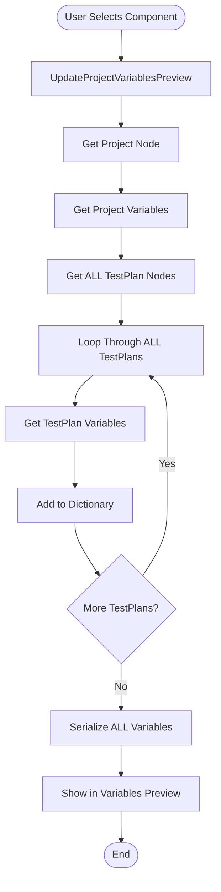
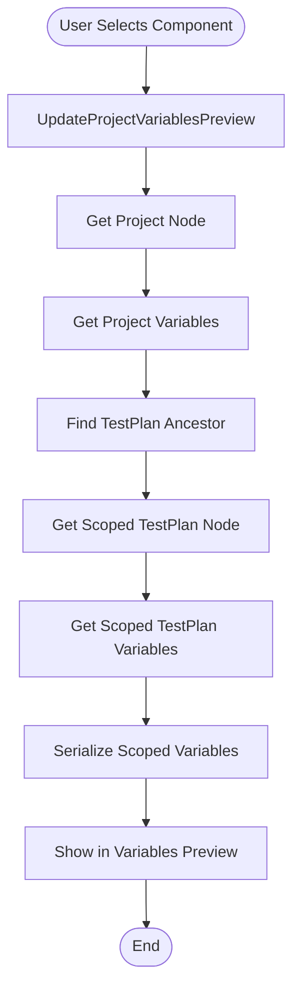
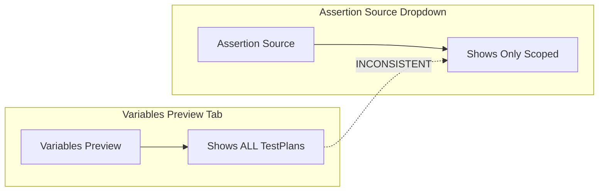
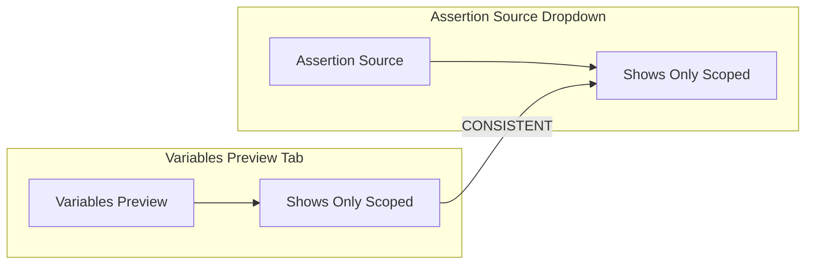

# Variables Preview Scoping Issue - Visual Diagrams

## Current Behavior (Problem)

```mermaid
graph TD
    subgraph "Project Structure"
        Project[Project]
        ProjectVars[Variables: { env: dev }]
        TestPlanA[TestPlan A]
        TestPlanAVars[Variables: { A: a }]
        TestPlanB[TestPlan B]
        TestPlanBVars[Variables: { B: b }]
        ThreadsA[Threads A]
        ScriptA[Script A]
        ThreadsB[Threads B]
        ScriptB[Script B]
    end

    Project --> ProjectVars
    Project --> TestPlanA
    Project --> TestPlanB
    TestPlanA --> TestPlanAVars
    TestPlanA --> ThreadsA
    ThreadsA --> ScriptA
    TestPlanB --> TestPlanBVars
    TestPlanB --> ThreadsB
    ThreadsB --> ScriptB

    subgraph "Current Variables Preview (WRONG)"
        CurrentPreview[Variables Preview]
        CurrentPreview --> ShowAll[Shows ALL Variables]
        ShowAll --> ProjectVars2[Project: { env: dev }]
        ShowAll --> TestPlanAVars2[TestPlan A: { A: a }]
        ShowAll --> TestPlanBVars2[TestPlan B: { B: b }]
    end

    subgraph "When Selecting Script A"
        SelectScriptA[Select Script A]
        SelectScriptA --> CurrentPreview
    end

    subgraph "When Selecting Script B"
        SelectScriptB[Select Script B]
        SelectScriptB --> CurrentPreview
    end
```

## Expected Behavior (Solution)

```mermaid
graph TD
    subgraph "Project Structure"
        Project[Project]
        ProjectVars[Variables: { env: dev }]
        TestPlanA[TestPlan A]
        TestPlanAVars[Variables: { A: a }]
        TestPlanB[TestPlan B]
        TestPlanBVars[Variables: { B: b }]
        ThreadsA[Threads A]
        ScriptA[Script A]
        ThreadsB[Threads B]
        ScriptB[Script B]
    end

    Project --> ProjectVars
    Project --> TestPlanA
    Project --> TestPlanB
    TestPlanA --> TestPlanAVars
    TestPlanA --> ThreadsA
    ThreadsA --> ScriptA
    TestPlanB --> TestPlanBVars
    TestPlanB --> ThreadsB
    ThreadsB --> ScriptB

    subgraph "When Selecting Script A (CORRECT)"
        SelectScriptA[Select Script A]
        SelectScriptA --> FindAncestorA[Find TestPlan A Ancestor]
        FindAncestorA --> ShowScopedA[Show Only Scoped Variables]
        ShowScopedA --> ProjectVarsA[Project: { env: dev }]
        ShowScopedA --> TestPlanAVarsA[TestPlan A: { A: a }]
    end

    subgraph "When Selecting Script B (CORRECT)"
        SelectScriptB[Select Script B]
        SelectScriptB --> FindAncestorB[Find TestPlan B Ancestor]
        FindAncestorB --> ShowScopedB[Show Only Scoped Variables]
        ShowScopedB --> ProjectVarsB[Project: { env: dev }]
        ShowScopedB --> TestPlanBVarsB[TestPlan B: { B: b }]
    end
```

## Data Flow Comparison

### Current Flow (Problem)



### Expected Flow (Solution)



## Code Comparison

### Current Code (Problem)

```csharp
// Collect all TestPlan variables for hierarchical structure
var testPlanNodes = projectNode.Children
    .Where(node => string.Equals(node.Type, "TestPlan", StringComparison.OrdinalIgnoreCase))
    .ToList();

var allTestPlanVariables = new Dictionary<string, object>(StringComparer.OrdinalIgnoreCase);
foreach (var testPlan in testPlanNodes)  // ← Loops through ALL TestPlans
{
    var tpVars = BuildDictionaryWithOverwrite(testPlan.Variables)
        .ToDictionary(entry => entry.Key, entry => (object)entry.Value, StringComparer.OrdinalIgnoreCase);
    if (tpVars.Count > 0)
    {
        allTestPlanVariables[testPlan.Name] = tpVars;
    }
}

// Shows ALL TestPlan variables
VariablesPreview = JsonSerializer.Serialize(new
{
    projectVariables = projectVariables,
    testPlans = allTestPlanVariables  // ← Shows ALL TestPlans
}, PrettyJsonOptions);
```

### Expected Code (Solution)

```csharp
// Find the TestPlan ancestor for the selected component
PlanNode? testPlanNode = null;
var current = SelectedNode;
while (current != null)
{
    if (string.Equals(current.Type, "TestPlan", StringComparison.OrdinalIgnoreCase))
    {
        testPlanNode = current;
        break;
    }
    current = current.Parent;
}

// Collect only the TestPlan variables that are in scope
var scopedTestPlanVariables = new Dictionary<string, object>(StringComparer.OrdinalIgnoreCase);
if (testPlanNode != null)
{
    var tpVars = BuildDictionaryWithOverwrite(testPlanNode.Variables)
        .ToDictionary(entry => entry.Key, entry => (object)entry.Value, StringComparer.OrdinalIgnoreCase);
    if (tpVars.Count > 0)
    {
        scopedTestPlanVariables[testPlanNode.Name] = tpVars;
    }
}

// Shows only scoped TestPlan variables
VariablesPreview = JsonSerializer.Serialize(new
{
    projectVariables = projectVariables,
    testPlans = scopedTestPlanVariables  // ← Shows only scoped TestPlan
}, PrettyJsonOptions);
```

## Example JSON Output

### Current Output (Problem)

When selecting **Script A** under TestPlan A:
```json
{
  "projectVariables": {
    "env": "dev"
  },
  "testPlans": {
    "A": {
      "A": "a"
    },
    "B": {
      "B": "b"
    }
  }
}
```

When selecting **Script B** under TestPlan B:
```json
{
  "projectVariables": {
    "env": "dev"
  },
  "testPlans": {
    "A": {
      "A": "a"
    },
    "B": {
      "B": "b"
    }
  }
}
```

**Problem:** Both show the same data (ALL TestPlans)

### Expected Output (Solution)

When selecting **Script A** under TestPlan A:
```json
{
  "projectVariables": {
    "env": "dev"
  },
  "testPlans": {
    "A": {
      "A": "a"
    }
  }
}
```

When selecting **Script B** under TestPlan B:
```json
{
  "projectVariables": {
    "env": "dev"
  },
  "testPlans": {
    "B": {
      "B": "b"
    }
  }
}
```

**Solution:** Each shows only the scoped TestPlan variables

## Assertion Source Consistency

### Current Behavior (Inconsistent)



### Expected Behavior (Consistent)



## Summary

The Variables preview tab currently shows ALL TestPlan variables regardless of which component is selected. This is inconsistent with the assertion source dropdown, which correctly shows only scoped variables.

The solution is to modify the `UpdateProjectVariablesPreview()` method to:
1. Find the TestPlan ancestor for the selected component
2. Collect only variables from Project + that TestPlan
3. Show only scoped variables in the Variables preview

This will make the Variables preview consistent with the assertion source dropdown and match user expectations.
